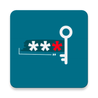
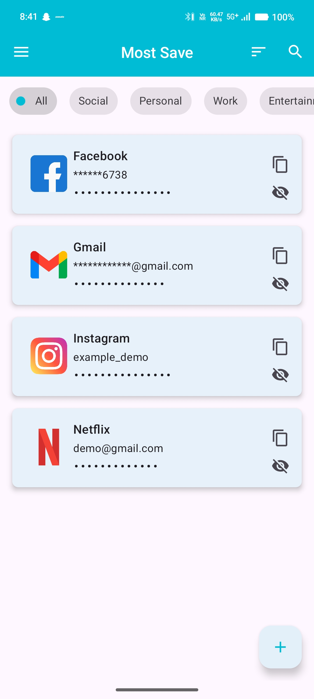
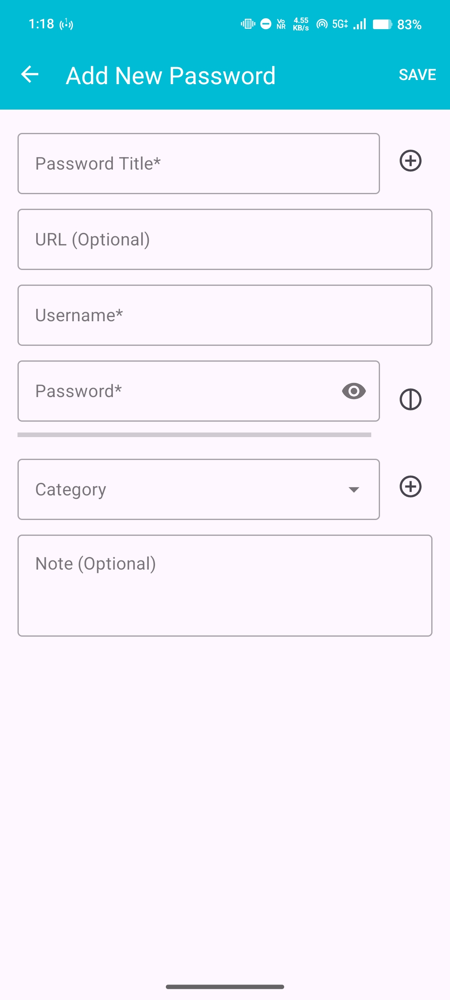
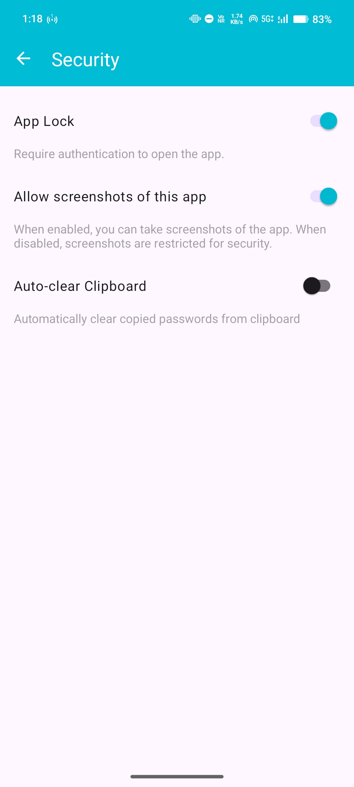
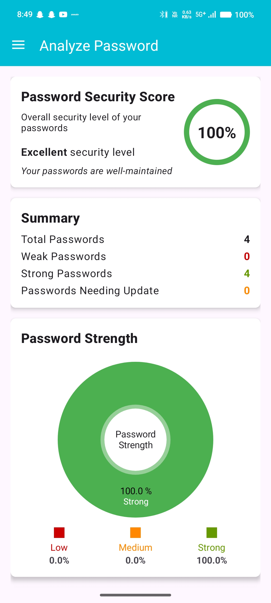

<div align="center">
  
  
  # MostSave - Secure Password Manager
  
  **Your Passwords Stay Here - Not Online**
  
  [](https://developer.android.com)
  [](https://android-arsenal.com/api?level=24)
  [](https://github.com/Abhibth0/Most_Save)
  [](https://github.com/Abhibth0/Most_Save/blob/main/LICENSE)
  
  [Download APK](https://github.com/Abhibth0/Most_Save/releases/latest) • [Report Bug](https://github.com/Abhibth0/Most_Save/issues) • [Request Feature](https://github.com/Abhibth0/Most_Save/issues)
</div>

---

## 🔐 Overview

MostSave is a **secure, offline password manager** designed for Android devices that prioritizes your privacy and security above all else. With military-grade encryption and biometric authentication, your passwords remain completely offline and under your control - never synced to the cloud.

### Why MostSave?
- 🛡️ **Complete Privacy**: Your data never leaves your device
- 🔒 **Military-Grade Security**: AES-256 encryption with SQLCipher
- 🚀 **Lightning Fast**: Instant access with biometric authentication
- 📱 **Modern Design**: Beautiful Material Design interface
- 🆓 **Completely Free**: No subscriptions, no ads, no tracking

---

## ✨ Key Features

### 🛡️ Security First
- **Offline Storage**: All passwords stored locally - never synced to the cloud
- **SQLCipher Encryption**: Military-grade AES-256 encryption for your database
- **Biometric Authentication**: Fingerprint and face unlock support
- **Security Analysis**: Built-in password strength analyzer
- **Auto-lock**: Configurable timeout for enhanced security
- **Master Password**: Strong master password protection

### 📱 User Experience
- **Material Design**: Clean, modern interface following Android design guidelines
- **Dark/Light Theme**: Customizable appearance with system theme support
- **Smart Organization**: Category-based password organization
- **Quick Actions**: One-tap copy, show/hide, and edit operations
- **Search & Filter**: Fast password search and sorting options
- **Intuitive Navigation**: Easy-to-use interface for all age groups

### 🔧 Advanced Features
- **Password Generator**: Create strong, unique passwords with customizable options
- **Favorites**: Quick access to frequently used passwords
- **Recycle Bin**: Safely recover accidentally deleted passwords
- **URL Integration**: Store and open associated websites
- **Multi-Select**: Bulk operations for efficient management
- **Export/Import**: Backup and restore your password database
- **Categories**: Organize passwords by type (Social, Banking, Work, etc.)

---

## 📱 Screenshots

<div align="center">
  
  
  
  
</div>

*Click on images to view full size*

---

## 🚀 Installation

### Requirements
- Android 7.0 (API level 24) or higher
- Biometric sensor (optional, for biometric authentication)

### Download Options

#### Option 1: GitHub Releases (Recommended)
1. Visit our [Releases page](https://github.com/Abhibth0/Most_Save/releases)
2. Download the latest APK file
3. Enable "Install from Unknown Sources" in your device settings
4. Install the APK file

#### Option 2: Build from Source
```bash
# Clone the repository
git clone https://github.com/Abhibth0/Most_Save.git

# Navigate to project directory
cd Most_Save

# Build the APK
./gradlew assembleRelease
```

---

## 🛠️ Technical Details

### Built With
- **Language**: Kotlin
- **Architecture**: MVVM (Model-View-ViewModel)
- **Database**: SQLCipher (encrypted SQLite)
- **UI Framework**: Material Design Components
- **Authentication**: Android Biometric API
- **Encryption**: AES-256 encryption

### Project Structure
```
app/
├── src/main/
│   ├── java/com/example/mostsave/
│   │   ├── data/          # Database and repositories
│   │   ├── ui/            # Activities and fragments
│   │   ├── utils/         # Utility classes
│   │   └── MainActivity.kt
│   ├── res/               # Resources (layouts, strings, etc.)
│   └── AndroidManifest.xml
├── build.gradle.kts       # App-level build configuration
└── proguard-rules.pro     # ProGuard configuration
```

### Key Dependencies
- SQLCipher for Android
- Android Biometric Library
- Material Design Components
- Kotlin Coroutines
- Room Database (with SQLCipher)

---

## 🔒 Security Features

### Encryption
- **Database**: Encrypted using SQLCipher with AES-256
- **Master Password**: Hashed using secure algorithms
- **Biometric Data**: Stored in Android Keystore

### Privacy
- **No Internet Required**: App works completely offline
- **No Data Collection**: We don't collect any personal information
- **No Analytics**: No tracking or analytics libraries
- **Open Source**: Code is transparent and auditable

### Best Practices
- Regular security audits
- Secure coding practices
- Minimal permissions required
- No sensitive data in logs

---

## 📈 Version History

### Current Version: 2.1.11 (Version Code: 13)
- 🔧 Bug fixes and performance improvements
- 🎨 UI/UX enhancements
- 🛡️ Security improvements

### Previous Versions
- **2.1.x**: Enhanced security features
- **2.0.x**: Material Design implementation
- **1.x.x**: Initial release with core features

---

## 🤝 Contributing

We welcome contributions from the community! Here's how you can help:

### Ways to Contribute
1. **Report Bugs**: [Create an issue](https://github.com/Abhibth0/Most_Save/issues)
2. **Suggest Features**: [Request new features](https://github.com/Abhibth0/Most_Save/issues)
3. **Submit Code**: Fork the repo and create a pull request
4. **Improve Documentation**: Help us improve our docs

### Development Setup
```bash
# Clone the repository
git clone https://github.com/Abhibth0/Most_Save.git

# Open in Android Studio
# Build and run on your device/emulator
```

### Guidelines
- Follow Kotlin coding conventions
- Write clear commit messages
- Test your changes thoroughly
- Update documentation when needed

---

## 📞 Support & Contact

### Developer Information
- **Developer**: Abhishek Patel
- **Email**: Abhishekpatelbth0@gmail.com
- **GitHub**: [@Abhibth0](https://github.com/Abhibth0)

### Get Help
- 📋 [Create an Issue](https://github.com/Abhibth0/Most_Save/issues)
- 📧 Email: Abhishekpatelbth0@gmail.com
- 💬 [Discussions](https://github.com/Abhibth0/Most_Save/discussions)

### FAQ
**Q: Is my data safe?**
A: Yes! All data is encrypted and stored locally on your device. We never sync to the cloud.

**Q: Can I backup my passwords?**
A: Yes, you can export your encrypted database for backup purposes.

**Q: Does it work without internet?**
A: Absolutely! MostSave works completely offline.

---

## 📄 License

This project is licensed under the MIT License - see the [LICENSE](LICENSE) file for details.

### MIT License Summary
- ✅ Commercial use allowed
- ✅ Modification allowed
- ✅ Distribution allowed
- ✅ Private use allowed
- ❌ No warranty provided

---

## 🙏 Acknowledgments

- Android development community
- Material Design team at Google
- SQLCipher team for secure database
- Open source contributors

---

## 📊 Statistics

<div align="center">
  
  
  
  
  
  
  
  
  
</div>

---

<div align="center">
  <strong>⭐ Star this repository if you find it helpful!</strong>
  <br>
  <br>
  Made with ❤️ by <a href="https://github.com/Abhibth0">Abhishek Patel</a>
</div>
